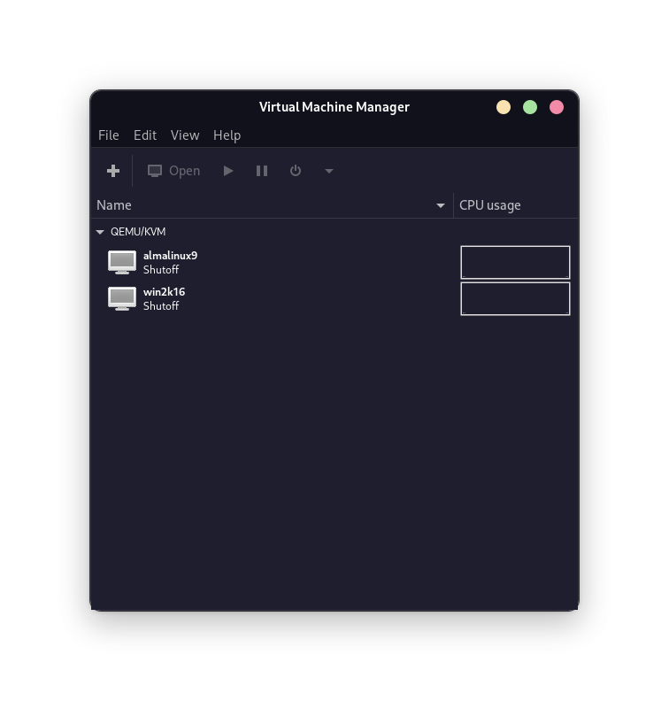

# Operating Systems 2024
## Created by Kryštof Malinda

## Information
> [!WARNING]
> The teacher decided to change the assignment. But he changes it at the beginning of every class. Which is beyond me, because if he wanted to change the assignment, he could have done it before the semester started. So if someone reports a change and I have time, I'll make the adjustment. Otherwise, I have more important things to do. But he said that if we're already done ahead of time, it's okay if we turn in the old assignment

Since the teaacher demands that everything be done via VMs in the school's EIT computer lab.
So after communicating with the teacher, who absolutely did not want to cooperate, he told me in a maximum annoyance that it could be done from his own PC.

You can just get around that by putting 


```bash
chown {login}:{login} {file_name}
```

**And he won't know anything and he'll be happy, and so complications can be avoided**

## Status of exercises
> [!NOTE]
 > All exercises can be found in adequate folders in this rep!


- [x] [cv1](cv1/cv1.md)
- [x] cv2
- [x] [cv3](cv3/cv3.md)
- [x] [cv4](cv4/cv4.md)
- [x] [cv5](cv5/cv5.md)
- [x] [cv6](cv6/cv6.md)
- [x] [cv7](cv7/cv7.md)
- [x] [cv8](cv8/cv8.md)
- [x] [cv9](cv9/cv9.md) [Speedrun of this](https://youtu.be/ECHbx_mDUpk)
- [x] cv10 - *Unclear assignment, probably cv9 is linked to cv10*
- [x] [cv11](cv11/cv11.md) - *I don't know how to set up Windows Server as specified, I tried*
- [x] [cv12](cv12/cv12.md) - *Not done*

## Software
**I recommend to make a virtual network made from two VMs**

- **The first VM** should be **Linux**, the distribution does not matter but [Alma Linux](https://almalinux.org/) is recommended

- **The second VM** should be **Windows** and it is recommended to use [Windows Server 2016 with Desktop](https://www.microsoft.com/en-us/evalcenter/download-windows-server-2016)

- Every script in this repository is made and tested on **Alma Linux**, but if your distribution is [RedHat based](https://en.wikipedia.org/wiki/Red_Hat_Enterprise_Linux_derivatives) there should be no complications



## Issues
Feel free to submit issues and enhancement requests or contact me on Discord `lynder063`
