> [!WARNING]
> Před začátkem s cvičením je dobrý si přejmenovat počítač *(změnit hostname)*. Většina lidí na to přijde ale stejnak [zde](https://support.microsoft.com/cs-cz/windows/p%C5%99ejmenov%C3%A1n%C3%AD-po%C4%8D%C3%ADta%C4%8De-s-windows-10-750bc75d-8ff8-e99a-b9dc-04dff566ae74) poskytnu officiální návod.

## V grafické prostředí vytvořte nového uživatele testX, kde X je číslo počítače. Heslo Password1* - Print Screen

- Přidáme roli
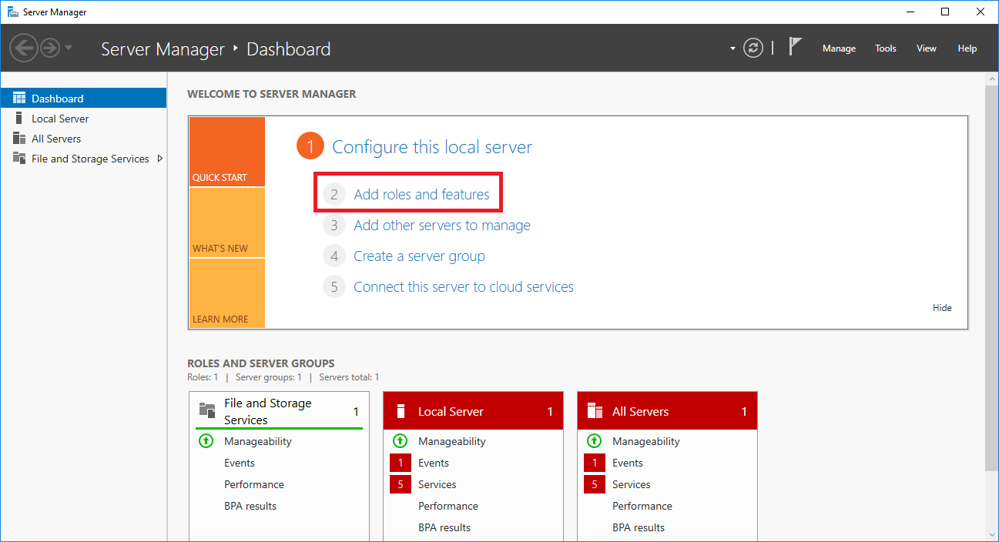 

- Vybereme že náš server je `Role-based`
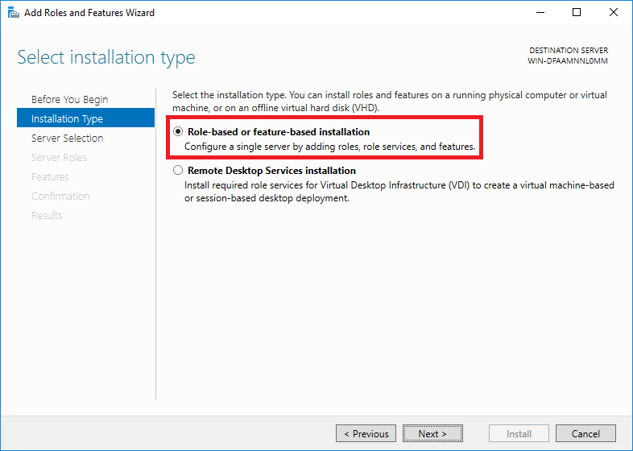 

- Nainstalujeme `Active Directory` pro správu uživatelů
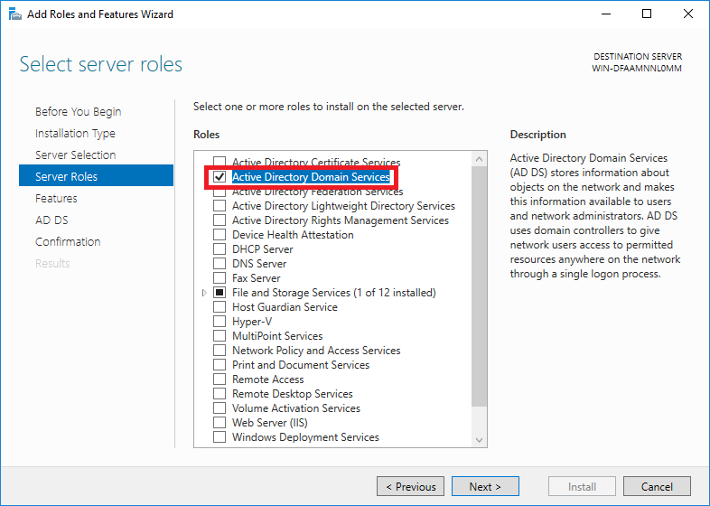 

- Vybereme, že chceme restartovat pokud je třeba a nainstalujeme
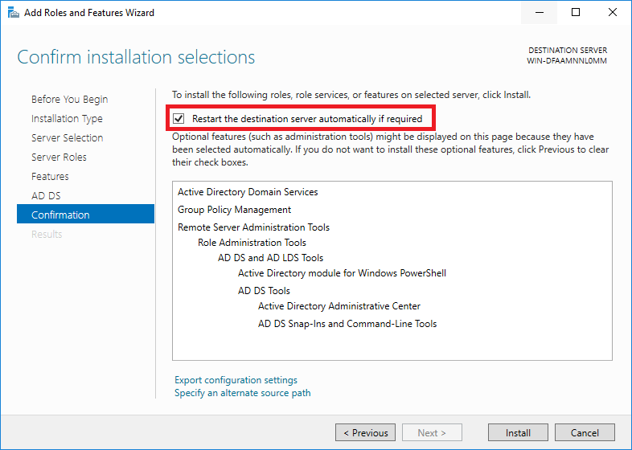 
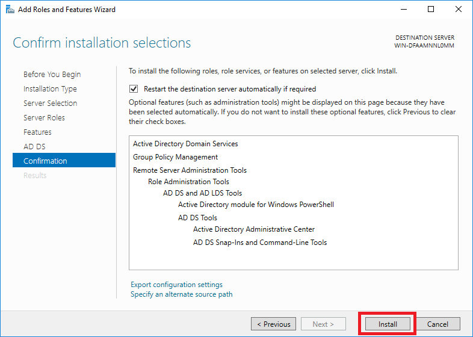 
- Po **úspěšné** instalaci, musíme dát `Promote this server to a domain controller`
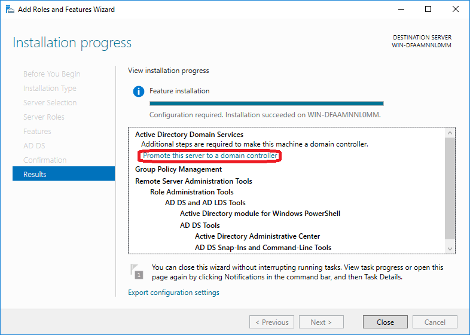 

- Při konfiguraci vytvoříme nový `forest` a jako root domain name můžeme dát `eit(cisloPC).vspj.cz`
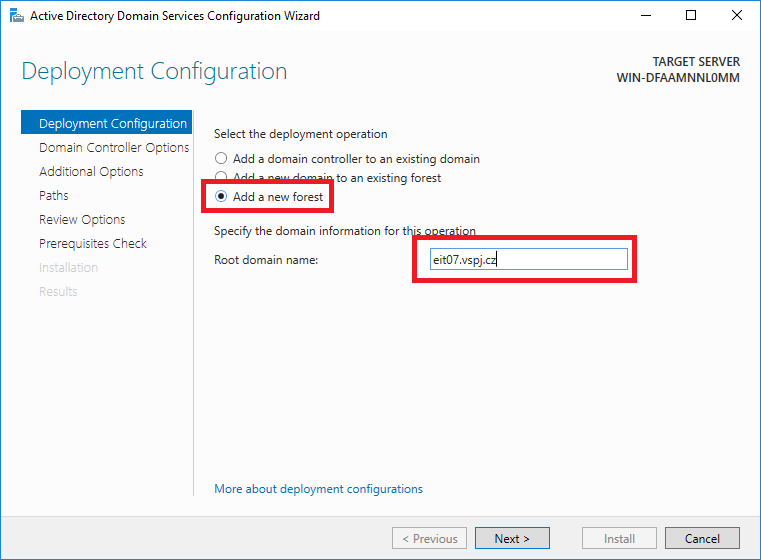 

- Zde musíme nastavit heslo abychom mohli pokračovat v instalaci já zvolil klasické `Password1*`
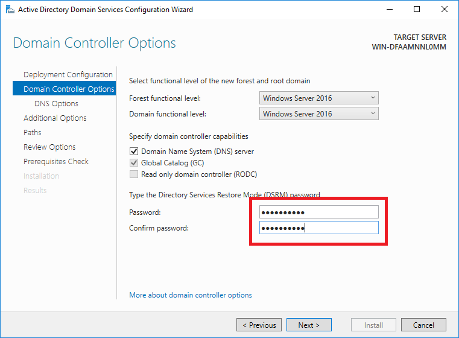 

- V této části se náma `NetBios` vytvoří sama tak necháme defaultní hodnotu, A projedem zbytek **wizardu** a nainstalujeme!
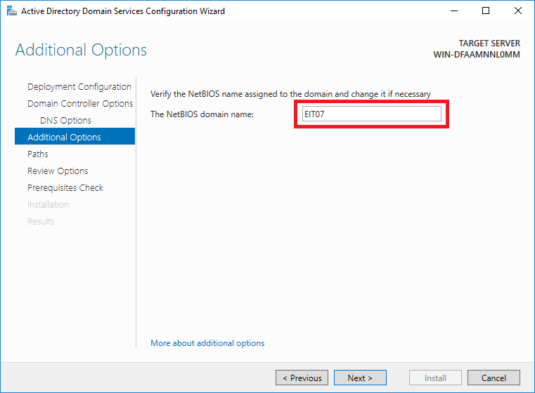 

- Půjdeme do `Tools > Active Directory Users and Computers`
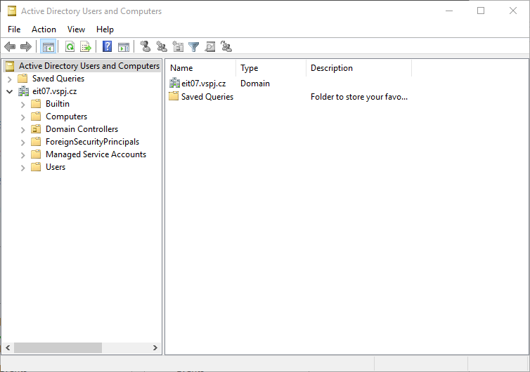 

- Teď si rozjedeme složku `Users` přidáme nového uživatele
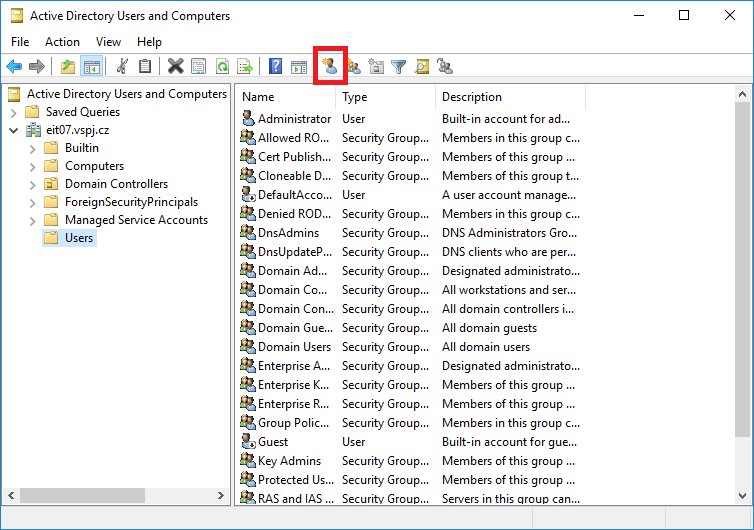 

- Do `User logon name` napíšeme `testX` *(kde X je číslo počítače)* a zbytek můžeme vyplnit podle svého uvážení
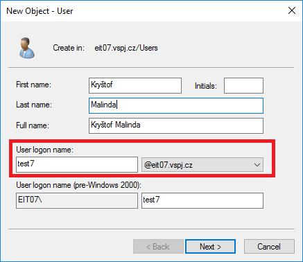 

- Nastavíme heslo `Password1*` a **odklikneme** možnost `User must change password at next logon`
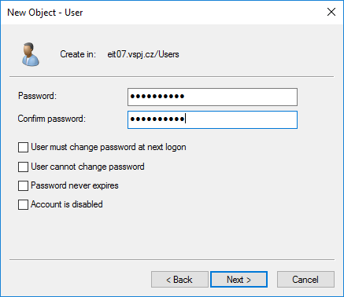 

## Vytvořte dávkový soubor (.bat), který vypíše přivítání konkrétního uživatele, informaci o přihlášeném jméně a bude čekat na zmáčknutí klávesy. Nevkládat spustit při startu, ale spustit uživatelský skript. Doložit příkazem a Print Screen

### Vložte tento skript do správného místa a zajistěte, aby se objevit při přihlášení uživateli testX

- Vytvoříme dávkový soubor *(.bat)* a vložíme ho třeba na `C:\` s tímto textem
```php
@echo off
echo Vítej %USERNAME%
echo Aktuálně jsi přihlášen jako: %USERNAME%@%USERDOMAIN%
pause
```
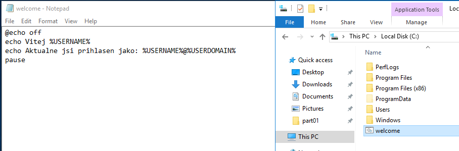 

- Pak spustíme script abychom zjistili jestli funguje
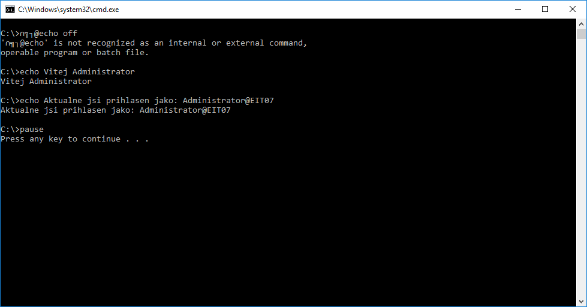 

- Pak se vrátime do `Active Directory Users and Computers > Users` a dáme `Properties` na našeho uživatele **testX** a do `Profile > Logon script` napíšeme cestuk našemu scriptu 
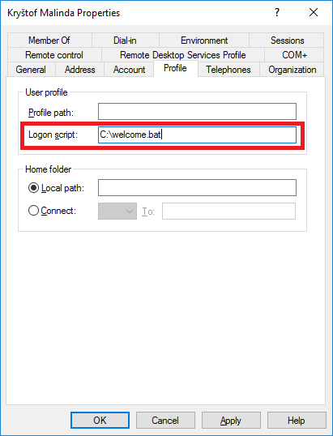 

## Nastavte politiku - například utilitou secpol.msc, aby heslo uživatelů vypršelo za 20 dní - Print Screen

- Pomocí klávesové zkratky `Server Manager` a půjdeme do `Tools > Group Policy Management` 
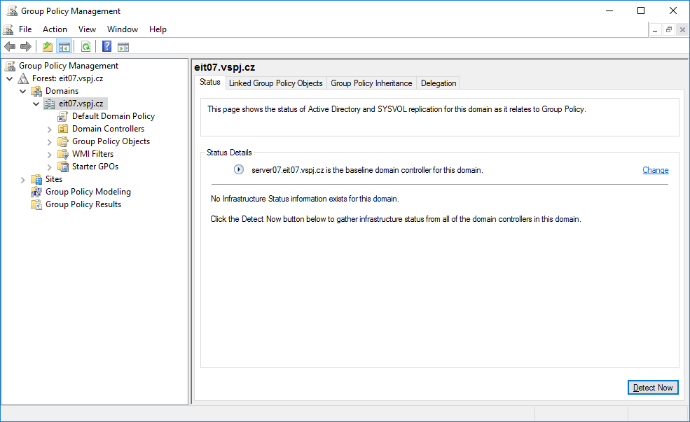 

- Vybereme v naší doméně `Group Policy Objects` a klikneme pravým na `Default Domain Policy` dáme `Edit` 
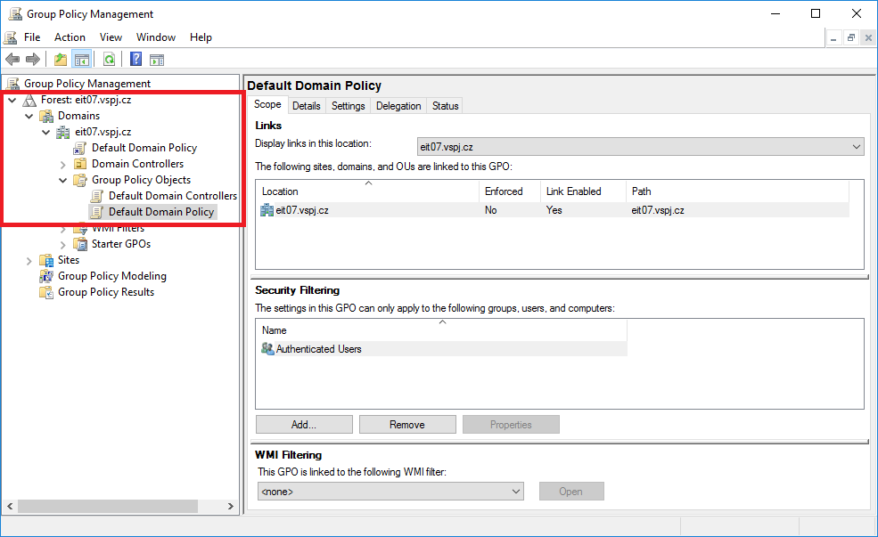 

- Pak budeme navigovat do `Computer Configuration > Policies > Windows Settings > Security Settings > Account Policies > Password Policy`
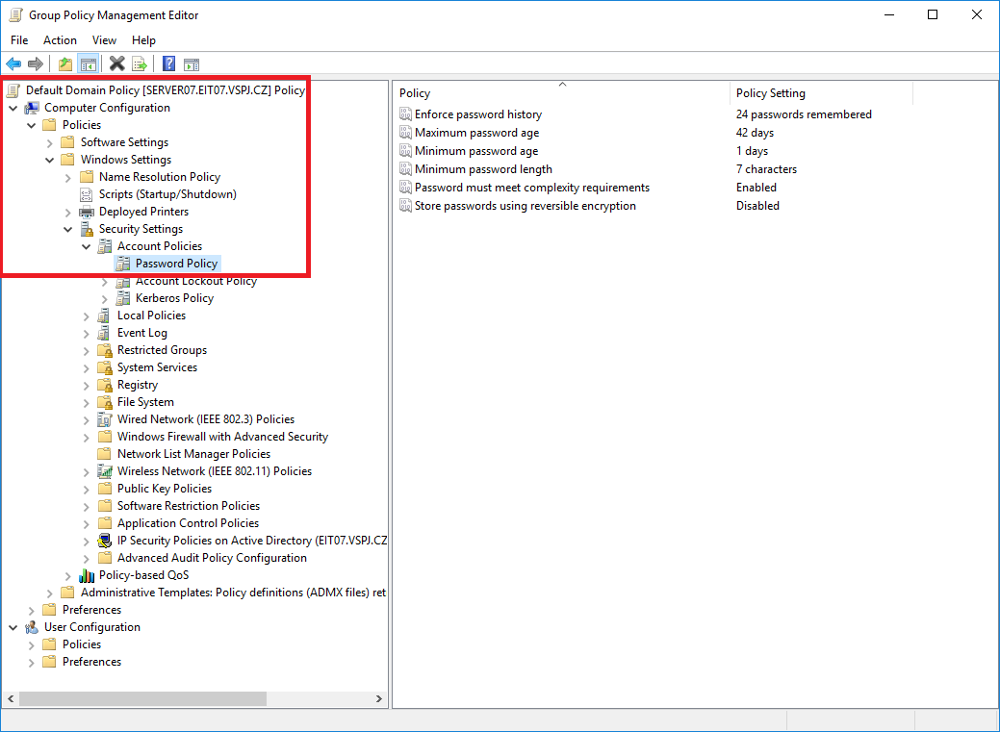 

- A změníme hodnotu v `Maximum password` na **20 dnů** 

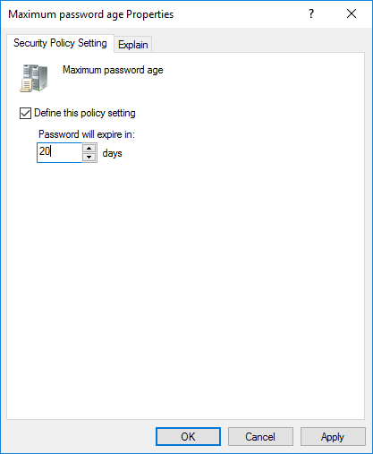 

## Vytvořte adresář pokus a nastavte, aby do něj mohl zapisovat jen uživatel testX. Toto nastavte pomocí NTFS práv. - Print Screen

- Vytvoříme si nějakou složku, já vytvořil složku `C:\jentest7\`
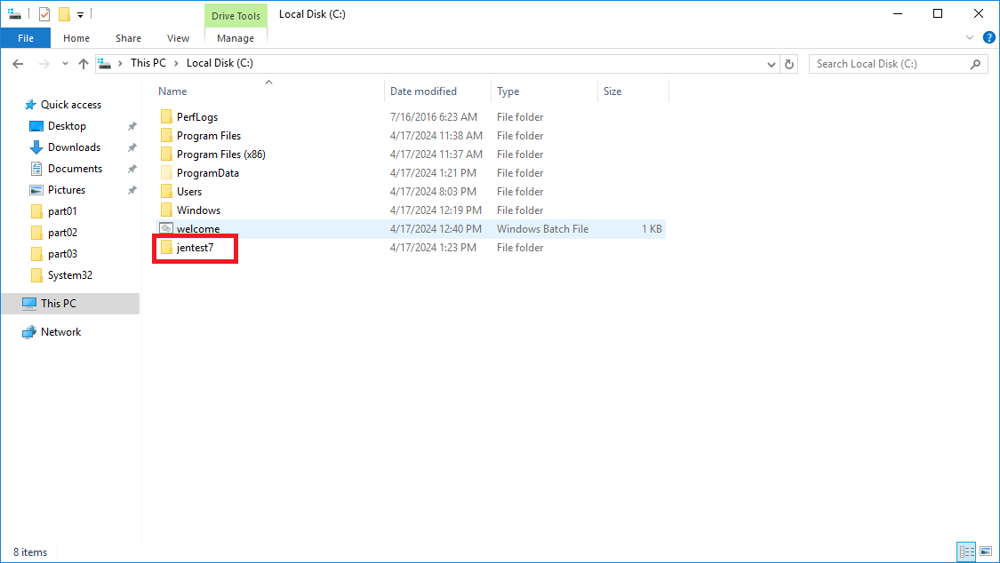 

- Klineme pravým na tuto složku a půjdeme do `Properties > Security`
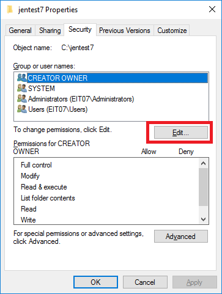 

- Zde klikneme na `Edit` a v dalším dialogovém okně klineme na `Add`
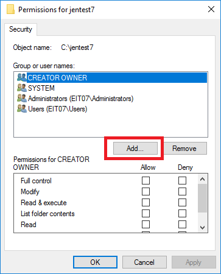 

- Napíšeme **Logon name** našeho uživatele a pro ověření klineme na `Check Names`
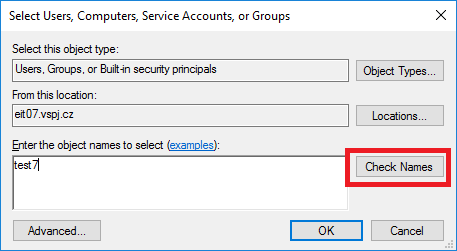 

- A mělo by se nám to takto opravit

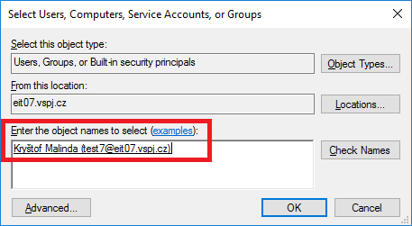 

- Teď všechno opravíme a vrátíme se zpět, vybereme našeho uživatele a zaklikneme `Full controll > Allow`
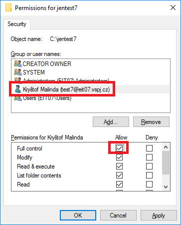 

- Ostatním uživatelům, skupinám nastavíme právo `Write > Deny`

- Pak otestujeme ku příkladu přetáhnutím nějakého souboru do složky `jentest7`
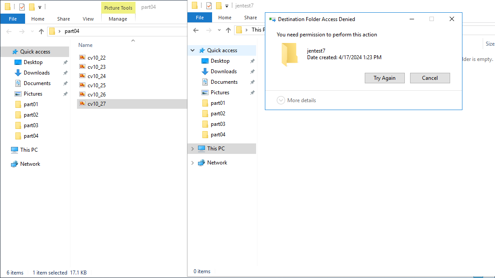 

## Vytvořte novou skupinu studenti a přidejte uživatele testX do této skupiny.- Print Screen

- Otevřeme `Server Manager > Tools > Active Directory Users and Computers` a klikneme pravým na `Users > New > Group` a pak jako název skupiny dáme **studenti**

- Pak klineme na nově vytvořenou skupinu **studenti** pravým tlačítkem a přejdeme do `Properties > Members` a dáme `Add`

- A stejně jako když jsme nastavovali pravomoce tak najdeme našeho uživatele

- A uděláme screenshot na odevzdání


## Nastavte audit na sledování přihlášení uživatelů. Odhlaste se a pak opět přihlaste. - Print Screen

- Otevřeme si `Server Manager` a půjdeme do `Tools > Group Policy Management` a stejně jako v úkolů dva si vybereme v naší doméně `Group Policy Objects` a klikneme pravým na `Default Domain Policy` a dáme `Edit`

- A pak se budeme navigovat do `Computer COnfiguration > Policies > Windows Settings > Security Settings > Advanced Audit Policy Configuration > Audit Policies > Logon/Logoff` 

- A nakonfigurujeme `Audit logoff`

- A ještě nastavíme `Audit logon`

- A uděláme printscreen, že jsme nastavili politiku

- Odhlasíme a přihlasíme se 


## Podívejte se na prohlížeč událostí, kdo se kdy přihlásil. - Print Screen

- Projedeme audit, otevřeme si aplikaci `Event Viewer`


- A když se teď se budeme navigovat do `Windows Logs > Security` *(a ID: 4624 je příhlášení a ID: 4634 je odhlášení)*


## Nakonfigurujte zásady účtu - místní zásady zabezpečení - pro nového uživatele testX nastavte, aby mohl měnit systémový čas - Print Screen

- Pomocí klávesové zkratky `Server Manager` a půjdeme do `Tools > Group Policy Management` 

- Vybereme v naší doméně `Group Policy Objects` a klikneme pravým na `Default Domain Policy` dáme `Edit` 

- A pak se budeme navigovat do `Computer Configuration > Policies > Windows Settings > Security Settings > Local Policies > User Rights Assignment`

- Pak si najdeme `Change the system time` a klikneme na `Add User or Group` přidáme našeho uživatele **testX** 

- Ověříme že se politika nastavila a uděláme screenshot

## Zálohujte celý registr do textového souboru. Print Screen

- Otevřeme si aplikaci `Registry Editor` *(regedit)* 


- Klikneme na `File > Export` chceme exportovat jako `TXT` a chceme nastavit **Export range** na `All` a uložíme

> [!WARNING]
> Je to dost dat takže to může chvilku trvat!

- Otevřeme si exportovaný soubor a uděláme screenshot do odevzdání


## Na disku vytvořte složku s názvem Vašeho loginu. Tuto složku připojte jako disk pomocí příkazové řádky. Doložit příkazem a Print Screen

- Otevřeme si `cmd.exe` a vložíme následující příkazy

- První příkaz pro tvorbu složky s naším loginem
```c
mkdir C:\vaslogin
```

- Připojí tuto složku jako disk vybral jsem si písmenko `Z`
```c
subst Z: C:\vaslogin
```


## Pomocí příkazové řádky  vytvořte 2 uživatele - doložit příkazem

- Jak předchozím cvíčení pustíme `cmd.exe` a vložíme následující přikazy
```c
net user User1 Password1* /add
```
```c
net user User2 Password1* /add
```

## Na disku nastavte diskovou quotu 1GB pro jednoho uživatele z úkolu 11. Print Screen

- Otevřeme průzkumník souborů a půjdeme na `This PC > Local Disk (C:)`

- A pak klikneme pravým a jdeme `Properties > Quota`

- Zaklikneme na `Quota Entries`

- V novém okně budeme navigovat do `Quota > New Quota Entry` a vybereme jednoho uživatele co jsme tvořili v předchozím kroku

- A nastavíme požadovaný limit

- A uděláme screenshot do odevzdání

## Pomocí příkazové řádky zobrazte tabulku arp Print Screen

- Otevřeme si `cmd.exe` a zadáme nasledující příkaz
```c
arp -a
```

> [!NOTE]
> Tento příkaz zobrazí aktuální obsah tabulky ARP, která obsahuje mapování IP adres na fyzické adresy *(MAC adresy)* v lokální síti.

- A uděláme screenshot na odevzdání

