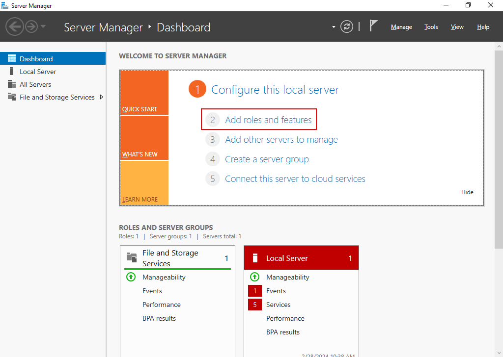
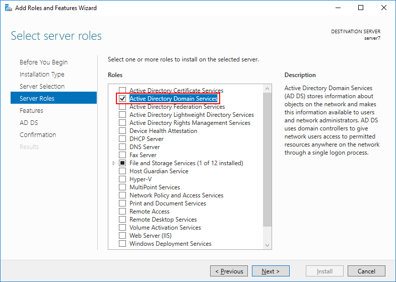
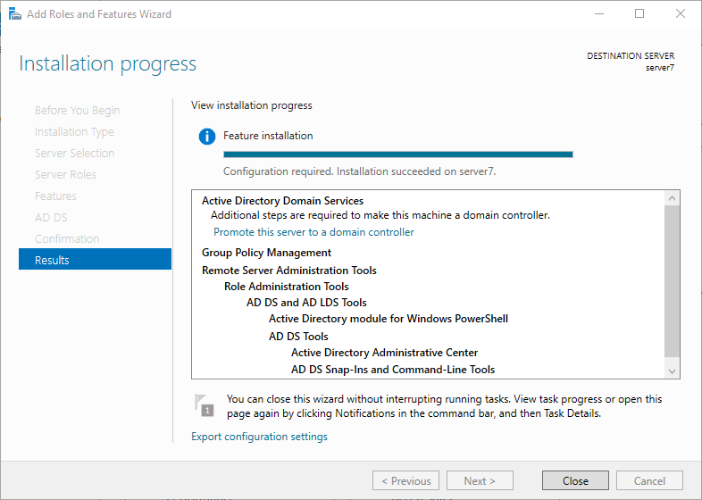
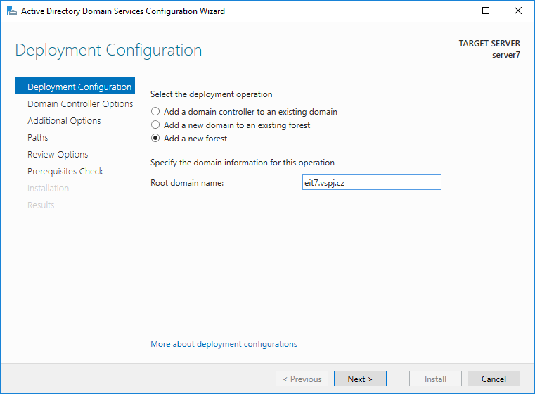
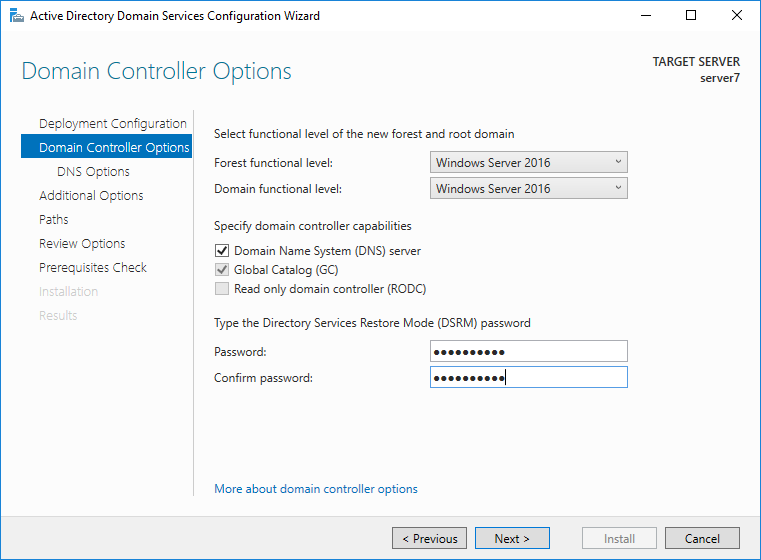
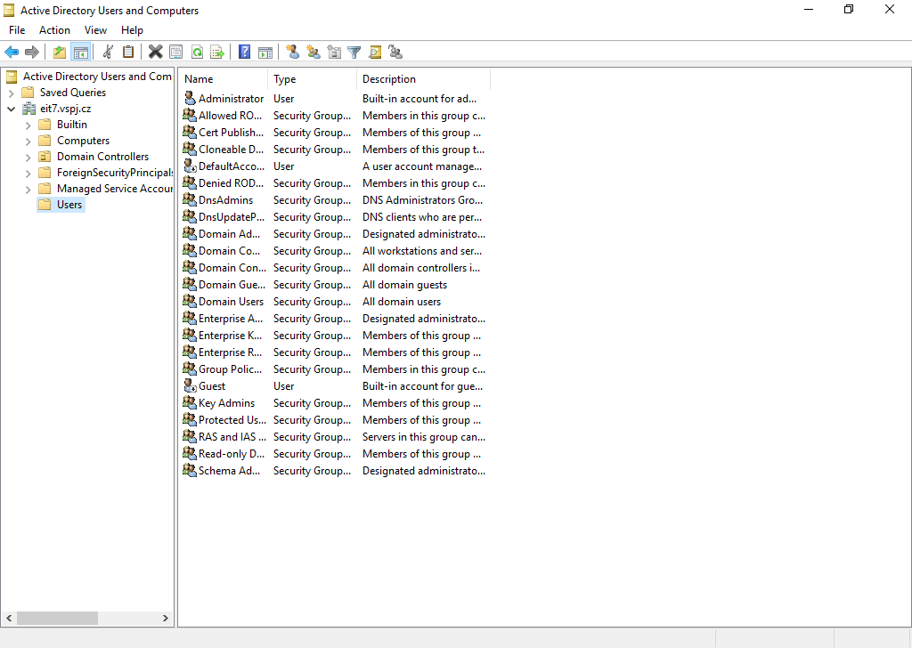
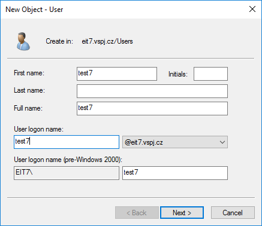
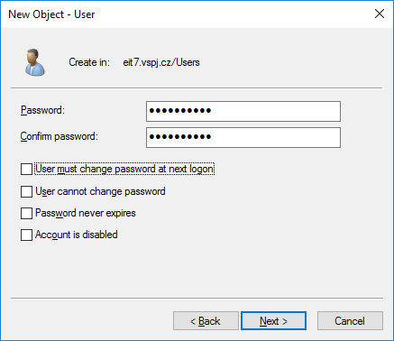
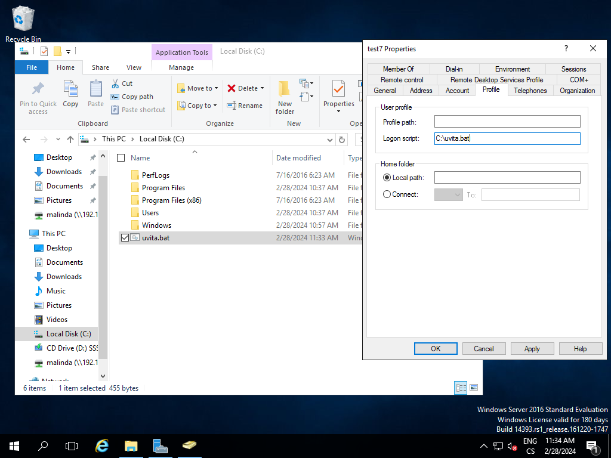

# V grafické prostředí vytvořte nového uživatele testX, kde X je číslo počítače. Heslo Password1*
- Musíme přídat AD abychom mohli spravovat uživatele






- Musíme nastavit AD, zadáme nějaké jméno domény

 

- Pak nastavíme heslo `Password1*`



- Přidáme uživatele





- Pak mu nastavíme heslo `Password1*` a odklikneme povinost změny hesla při dalším loginu



# Vytvořte dávkový soubor (.bat), který vypíše přivítání konkrétního uživatele, informaci o přihlášeném jméně a bude čekat na zmáčknutí klávesy. Nevkládat spustit při startu, ale spustit uživatelský skript.

- Vytvoříme script

```bat
@echo off
rem Získat uživatelské jméno
rem (funguje pouze v cmd.exe, ne v powershell)
set "username=%USERNAME%"

rem Zobrazit přivítání
echo ======================================
echo Vítejte, %username%!
echo ======================================
echo Jste přihlášeni jako: %username%
echo Datum a čas: %DATE:~0,10% %TIME:~0,8%
echo ======================================

rem Čekat na stisk klávesy
pause >nul

rem Ukončit skript
exit
```

- Přesunemeho na `C:\` a nastavíme aby se spouštěl při přihlášení našeho uživatele

 
