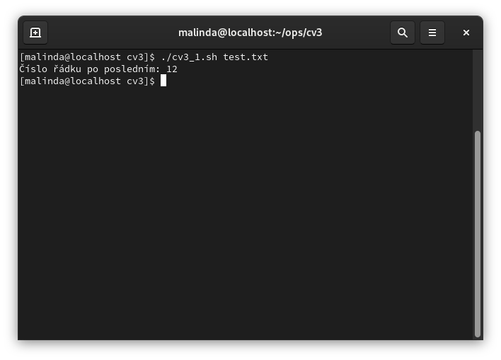
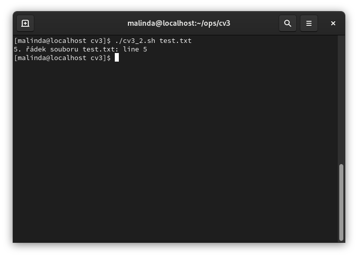
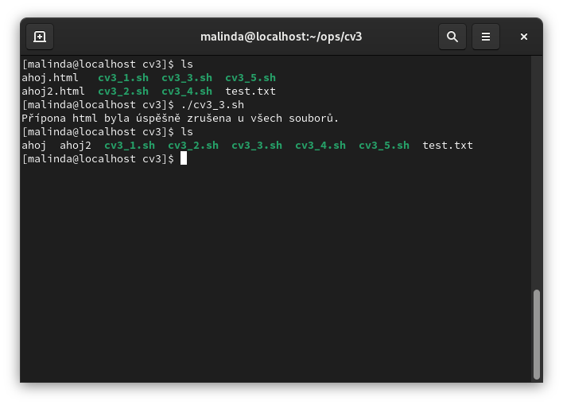
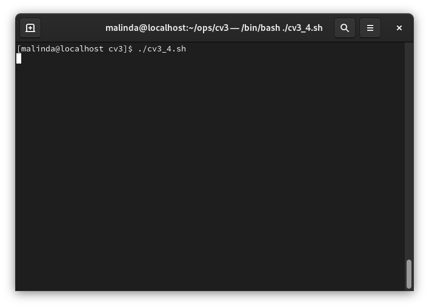
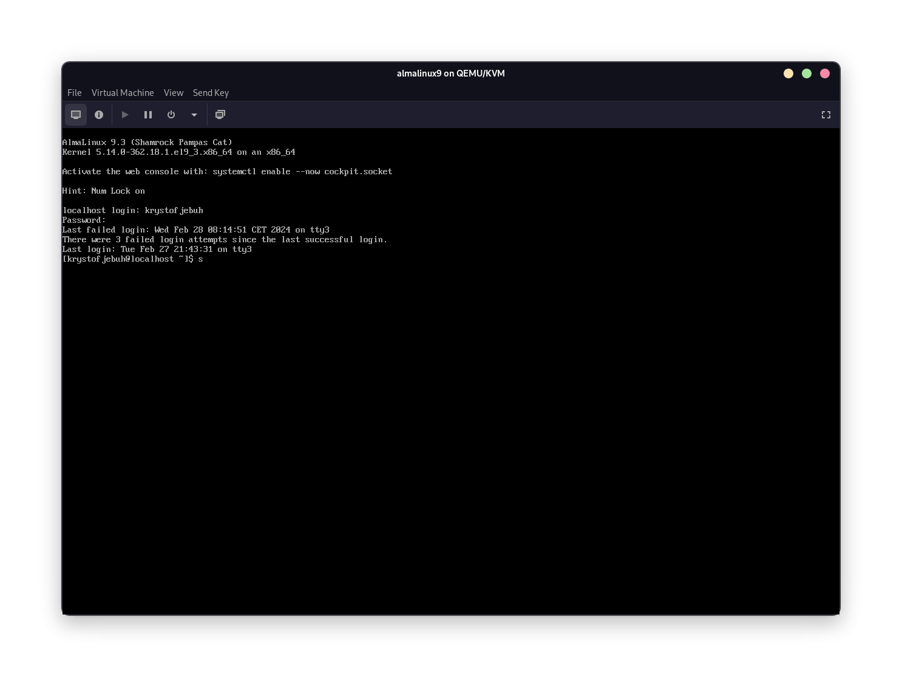
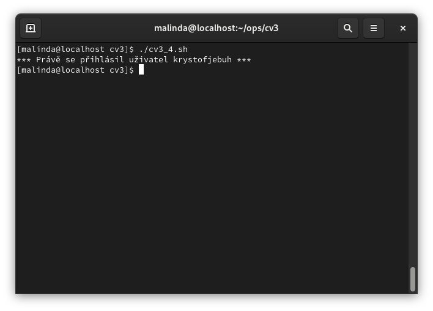

# Vytvořte skript s názvem cv3_1.sh, který vypište číslo řádku z nějakého souboru, který by následoval za posledním (k číslu posledního řádku přičtěte 1).
 

 
# Vytvořte skript s názvem cv3_2.sh, který vypište 5. řádek z tohoto souboru.

 
- Vytvořte skript s názvem cv3_3.sh, který zruší u všech souborů tuto příponu.

 

- Vytvořte skript s názvem cv3_4.sh, který pomocí cyklu until bude čekat  na  přihlášení vytvořeného uživatele. V případě jeho přihlášení se vypíše hlášení: ***právě se přihlásit uživatel (jeho jméno) ***. Přihlášení nového uživatele proveďte v novém terminále (ctrl+shift+F2). Zpět do prvního terminálu se vrátíte alt+F1.

- Spuštění scriptu

- Příhlášení za uživatele
 

- Reakce scriptu a přihlášení

- Vytvořte skript s názvem cv3_5.sh, který vypíše po zadání jména a příjmení ve formě argumentu:

[Úkol 5](../assests/cv3/ukol5.png) 
