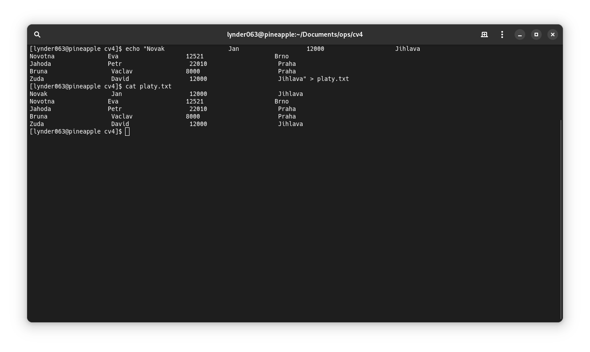

## Vytvořte soubor výplaty v tomto tvaru.
```bash
echo "
Novak                  Jan                   12000                    Jihlava         
Novotna               Eva                   12521                    Brno           
Jahoda                Petr                   22010                    Praha         
Bruna                  Vaclav               8000                      Praha        
Zuda                   David                 12000                    Jihlava
" > platy.txt
```
- Zde je očekáváný output
 


## Vypište první a třetí sloupec
```bash
awk '{print $1, $3}' platy.txt
```

## Vyberte řádky obsahující slovo Jihlava
```bash
awk '/Jihlava/' platy.txt
```

## Vypište 1. , 2. a 4. sloupec pro  řádky obsahující slovo Jihlava
```bash
awk '/Jihlava/{print $1, $2, $4}' platy.txt
```

## Vyberte všechny řádky obsahující v 4. sloupci písmeno P
```bash
awk '$4 ~ /P/' platy.txt
```

## Vyberte všechny řádky obsahující v 4. sloupci první písmeno P
```bash
awk '$4 ~ /^P/' platy.txt
```

## Vyberte všechny pracovníky, kteří mají plat = 12000
```bash
awk '$3 == 12000' platy.txt
``` 

## Vyberte všechny pracovníky, kteří mají plat < 12000

```bash
awk '$3 < 12000' platy.txt
```

## Vyberte všechny pracovníky, kteří mají plat < 20000 a větší než 10000


```bash
awk '$3 < 20000 && $3 > 10000' platy.txt
```

## Vyberte všechny pracovníky, kteří jsou z Brna nebo z Jihlavy
```bash
awk '$4 == "Brno" || $4 == "Jihlava"' platy.txt
```

## Vypište číslo řádku, na kterém je ve sloupci Petr.
```bash
awk '$2 == "Petr" {print NR}' platy.txt
```

## Zobrazte 2. a 4. řádek
```bash
awk 'NR==2 || NR==4' platy.txt
```

## Vypočtěte průměrný platy
```bash
awk '{sum+=$3} END {print "Průměrný plat: ", sum/NR}' platy.txt
```

## Vypočtěte průměrný plat pro všechny pracovníky z Jihlavy.
```bash
awk '$4 == "Jihlava" {sum+=$3; count++} END {print "Průměrný plat pro pracovníky z Jihlavy: ", sum/count}' platy.txt
```

## Vypište maximální plat.
```bash
awk 'BEGIN {max=0} $3 > max {max=$3} END {print "Maximální plat: ", max}' platy.txt
```

## Vytvořte program, který každé 2 minuty zkopíruje výpis obsahu vybraného adresáře do souboru.

- Příkladný program který by se měl spouštět
```bash
#!/bin/bash

# Definujte cestu ke zdrojovému a cílovému adresáři
source_dir="/home/lynder063/zdroj"
target_dir="/home/lynder063/cil"


# Zkopírujte obsah zdrojového adresáře do cílového adresáře
cp -r "$source_dir"/* "$target_dir"
```

> [!WARNING]
> Hodnoty `source_dir` a `target_dir` musíte upravit podle sebe a svých složek  

- Nově vytvořenému souburu musíme přidat práva na exekuci
```bash
chmod +x {název_souboru}.sh
```

- Pak si otevřenem cron configuraci
```bash
crontab -e
```

> [!TIP]
> Na internetu je stránka která vám generuje crontab syntax. [ZDE ODKAZ](https://crontab.guru/)

```bash
*/2 * * * * ./cesta/k/souboru.sh
```

**NEBO**

```bash
*/2 * * * * cp -r /cesta/ke/zdrojovemu/adresari /cesta/k/cilovemu/adresari
```
