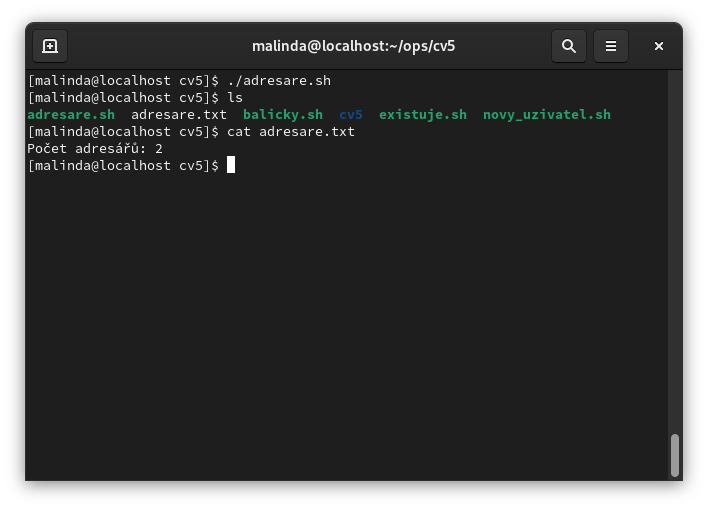
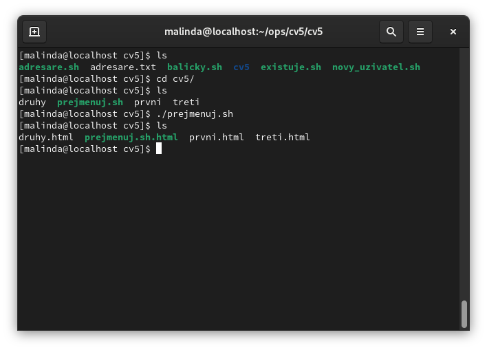
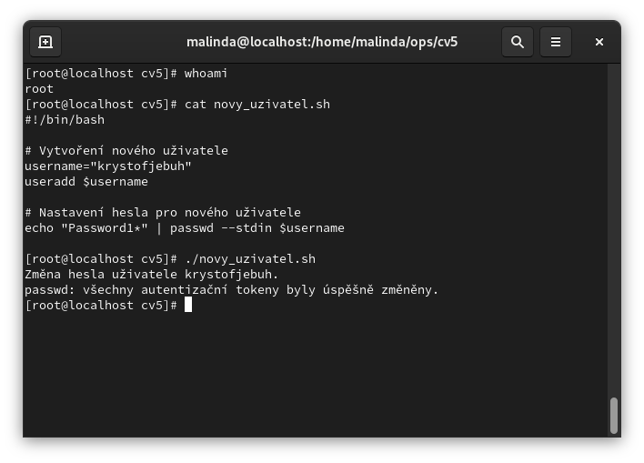
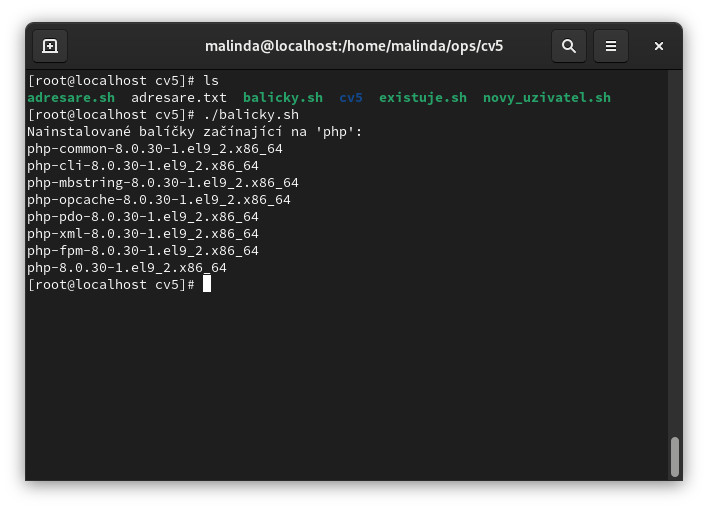
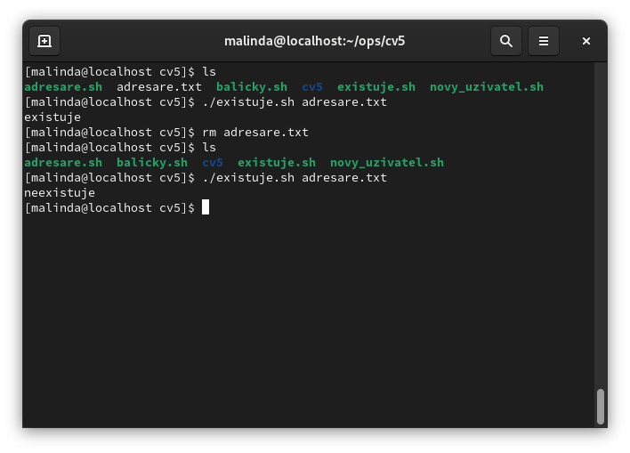

# V systému Linux vytvořte skript s názvem adresare, který vypíše počet adresářů v aktuálním adresáři do souboru.

## V Linuxu vytvořte adresář cv5 a v něm vytvořte 3 soubory: první, druhý, třetí. Dále v něm vytvořte skript s názvem prejmenuj, který dá všem souborům příponu .html.

## Přihlaste se do Linuxu pod účtem root. Vytvořte skript, který vytvoří nového uživatele a nastaví mu heslo.

## V Linuxu vytvořte skript s názvem balíčky, který po spuštění vypíše všechny nainstalované balíčky, které začínají na php. Pokud tam žádný balíček není, nainstalujte ho. 

## V Linuxu vytvořte skript s názvem existuje, který zjistí , zda je nějaký soubor existuje nebo ne. Výsledkem bude text: „existuje“ nebo „neexistuje“.

 
