# Napište příkaz, který vypíše vaše aktuální UID.

```bash
id -u
```
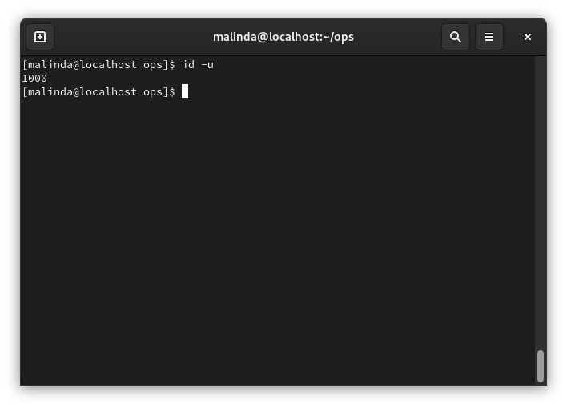 

# Napište příkaz, který vypíše seznam skupin, v nichž se nacházíte. 

```bash
groups
```

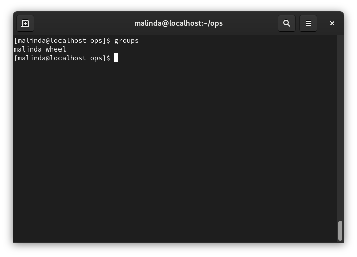

# Vytvořte soubor jmena.txt s 21 jmény. Z výstupu jmena.txt vypište jen sudé řádky a  na začátky lichých řádek souboru jmena.txt vložte znak „l", na začátky sudých řádek vložte znak „s".

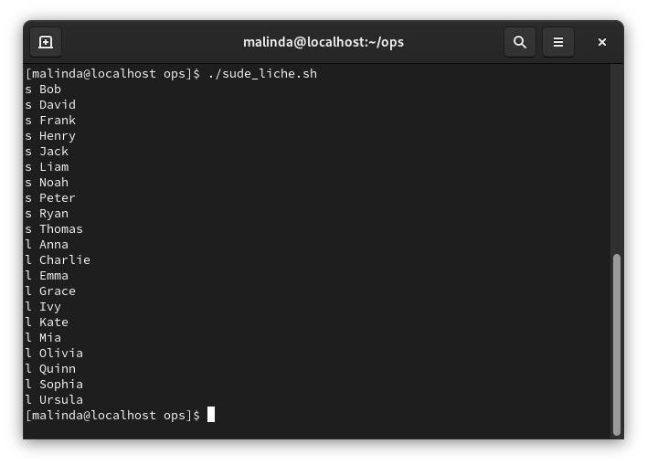

# b za každý řádek přidá volný řádek

```bash
sed G jmena.txt
```

# Na začátky desáté až dvacáté řádky souboru jmena.txt přidejte znak #. 

```bash
sed '10,20 s/^/#/' jmena.txt
```

# Pomocí příkazu najděte soubor jmena.txt v adresáři /home i v podadresářích

```bash
find /home -name "jmena.txt"
```

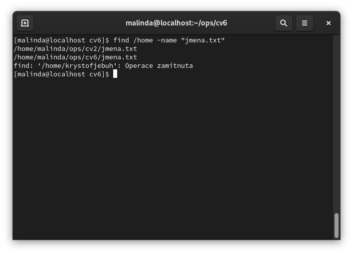 

# Pomocí příkazu najděte v adresáři /home i v podadresarich všechny soubory začínající j s příponou .txt 
```bash
find /home -type f -name "j*.txt"
```

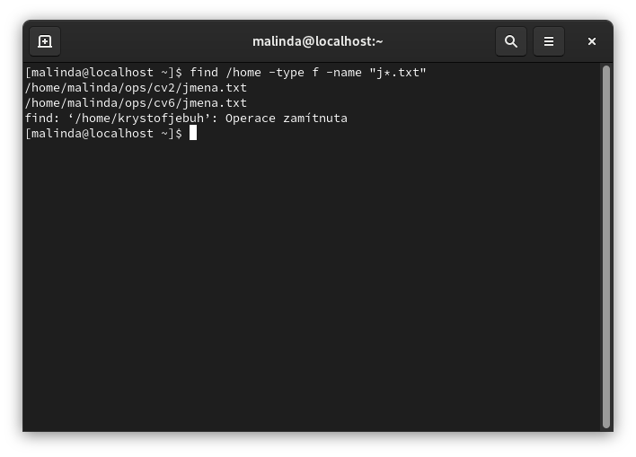

# Pomocí příkazu najděte v adresáři /home i v podadresářích vše, co bylo změněno před 7 dny.

```bash
find /home -type f -mtime +7
```

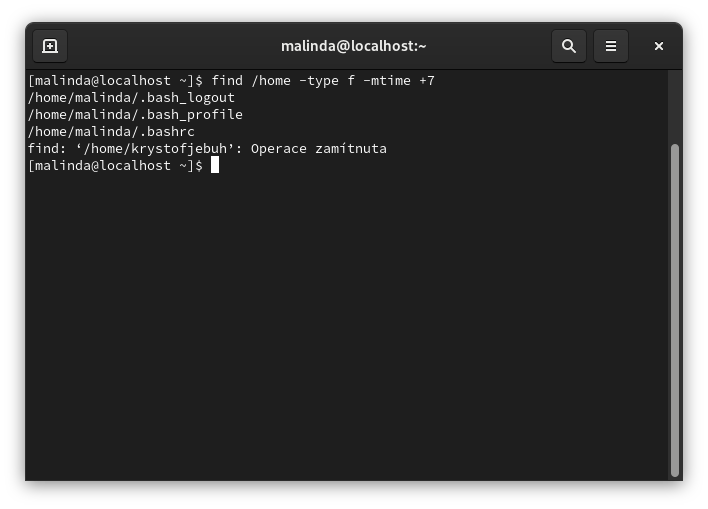 

# Zjištění rodičovského procesu

- Spusťte zobrazení procesů


```bash
ps -l
```

 

- Jaký je rodičovský proces procesu ps?

**Měl by to být uživatelský shell**

# Zobrazte celou stromovou strukturu všech procesů operačního systému.

```bash
pstree
```

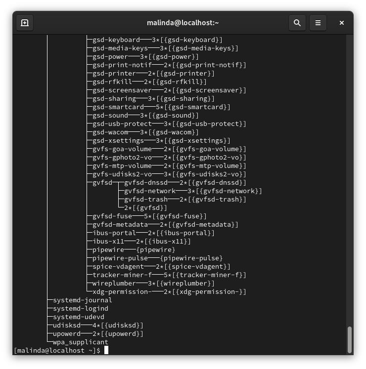 

# Procesy na pozadí, popředí gedit, &, bg, fg, ^+Z, jobs

- Spustíme Textový editor GEdit


```bash
gedit &
```
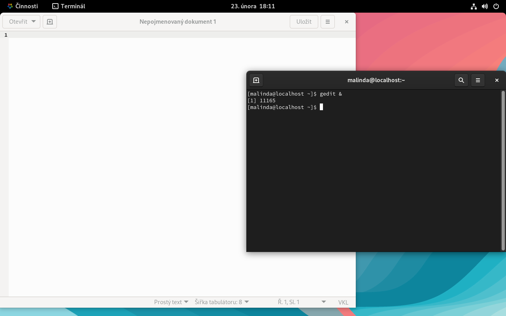

- Dáme process do pozadí


```bash
bg %1
```

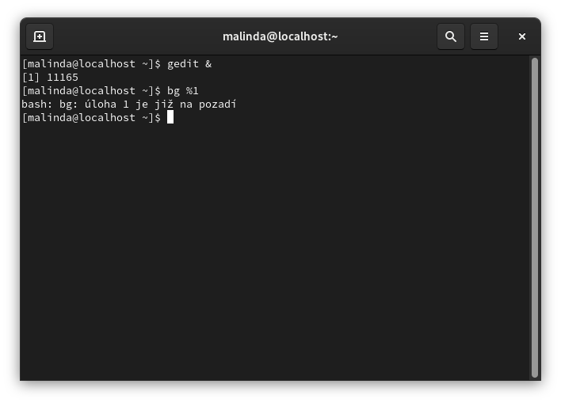

- Přeneseme proces do popředí

```bash
fg %1
```

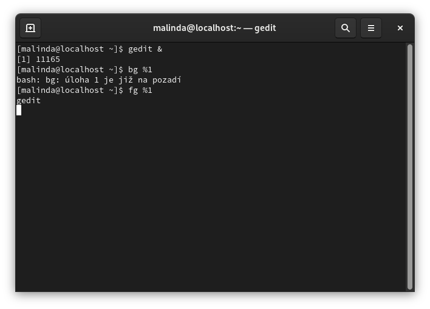 

# Sledujte procesy v reálném času top

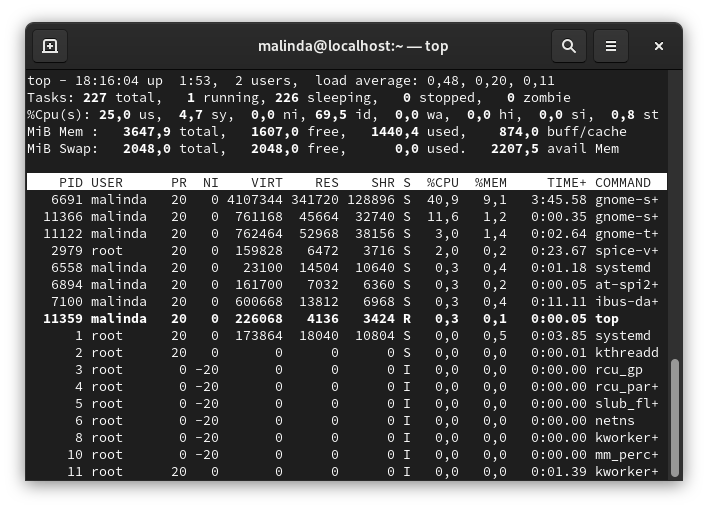

# Pojmenovaná roura

- Vytvoříme routu

```bash
mkfifo roura
```

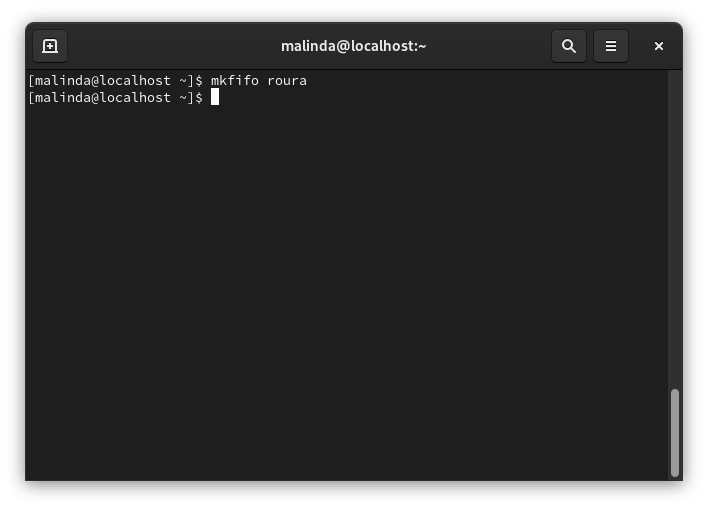

- Načtení datumu do routy

> [!WARNING]
> Je nutné aby bežela na pozadí

```bash
date > roura &
```

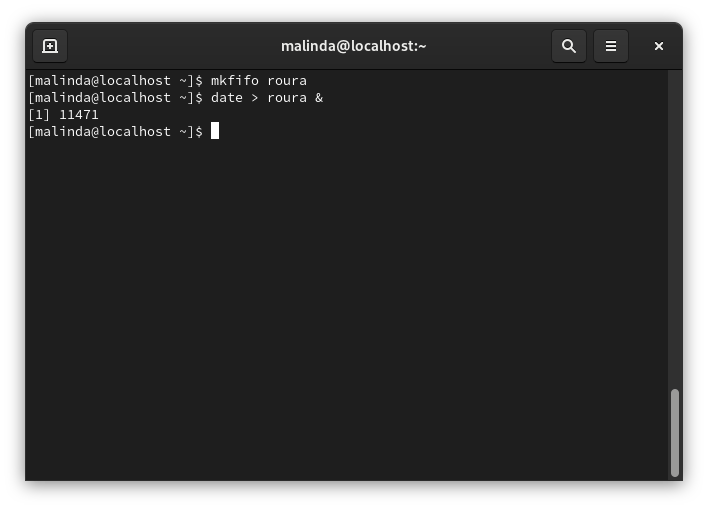 

- Zobrazení dat

```bash
cat roura
```

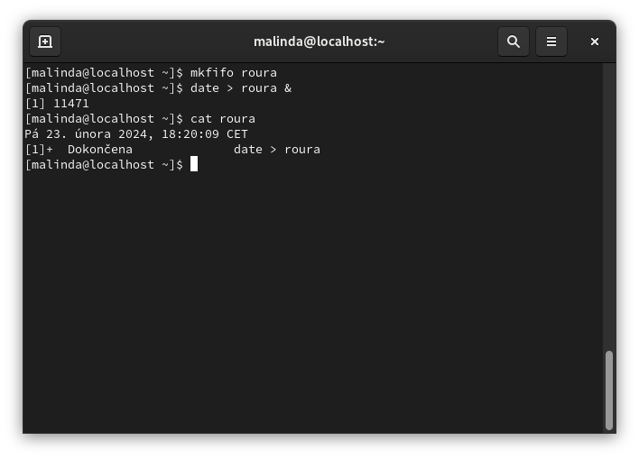 
