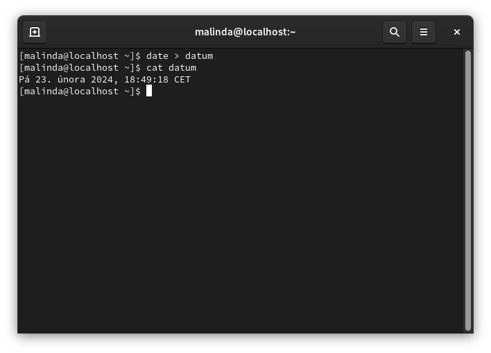
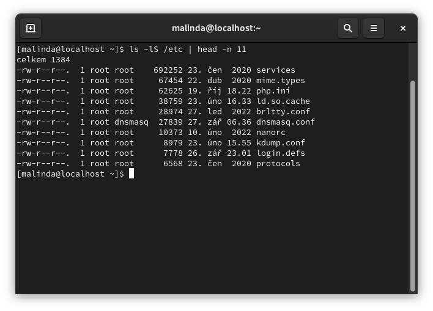
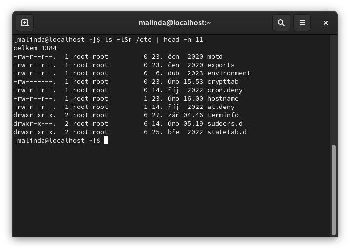
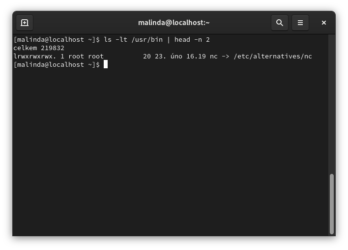

# Pomocí příkazu vytvořte soubor se jménem „datum". Do tohoto souboru vložte pomocí příkazu aktuální datum.

```bash
date > datum
```



# Vypište deset největších souborů a pak deset nejmenších souborů v adresáři /etc

- Největší soubor
```bash
ls -lS /etc | head -n 11
```
 

- Nejmenší soubor
```bash
ls -lSr /etc | head -n 11
```



# V adresáři /usr/bin najděte soubor, který byl modifikován naposledy.

```bash
ls -lt /usr/bin | head -n 2
```

 


