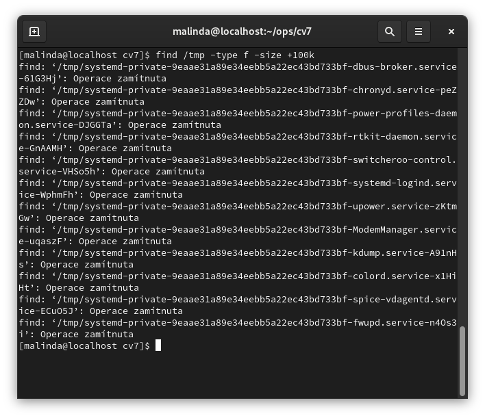

# Pomocí příkazu vytvořte soubor se jménem „datum". Do tohoto souboru vložte pomocí příkazu aktuální datum.

```bash
date > datum
```


# Vypište deset největších souborů a pak deset nejmenších souborů v adresáři /etc

- Největší soubor
```bash
ls -lS /etc | head -n 11
```
 

- Nejmenší soubor
```bash
ls -lSr /etc | head -n 11
```


# V adresáři /usr/bin najděte soubor, který byl modifikován naposledy.

```bash
ls -lt /usr/bin | head -n 2
```

 

# Ze souboru studenti.csv (stáhněte si v této lekci) vypište jen první sloupec, tj. sloupec s příjmeními (použijte find, případně cut).

```bash
cut -d ',' -f 1 studenti.csv
```


# dělejte kopii souboru studenti.csv, nahraďte pomocí příkazu středníky pomlčkou a pomocí diff se podívejte, které řádky byly změněny.

```bash
# Udělá se kopie
cp studenti.csv studenti_copy.csv 

# Nahradíme ;, -
sed -i 's/;/-/g' studenti_copy.csv

# Ukážeme rozdíl
diff studenti.csv studenti_copy.csv
```


# Rozdělte příkazem  studenti.csv soubor na kusy po pěti řádcích (split).
```bash
split -l 5 studenti.csv studenti_chunk_
```


# Napište příkaz, který vypíše počet všech (pro vás viditelných) adresářů v podstromu /etc
```bash
find /etc -type d | wc -l
```


# V podstromu adresáře /tmp najděte všechny soubory, které jsou větší než sto kilobyte (find).

```bash
find /tmp -type f -size +100k
```



# Do své složky (home) zkopírujte soubor /etc/passwd, který přejmenujete například na passwd2. V souboru passwd2 odstraňte nějaké řádky. Vytvořte skript, který projde vytvořené uživatele (/etc/passwd)  a  zjistí, rozdíl se souborem passwd2 (diff). Rozdíl se uloží do souboru rozdil.txt. Tedy zjistí, kteří uživatelé jsou v souboru /etc/passwd navíc.  

- ZKopírování souboru ` /etc/passwd`


```bash
cp /etc/passwd ~/passwd2
```

- Odstranímě **nějaké** řádky *(vybral jsem 2 a 5)*

```bash
sed -i '2d;5d' passwd2
```

 

- Pustíme script


# Pomocí příkazu vypište verzi OS linux (číslo jádra a další informace).

```bash
uname -a
```

 
