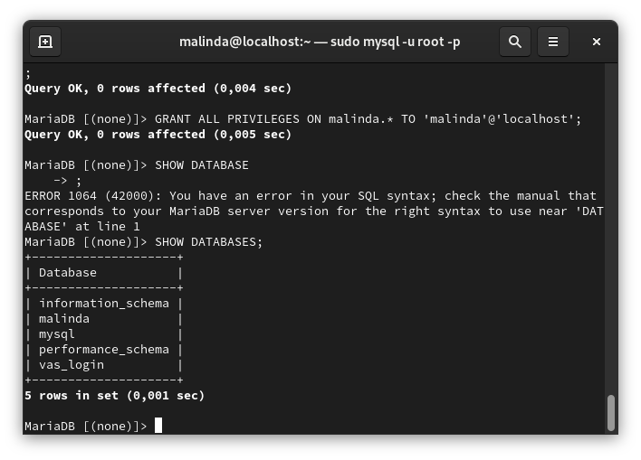
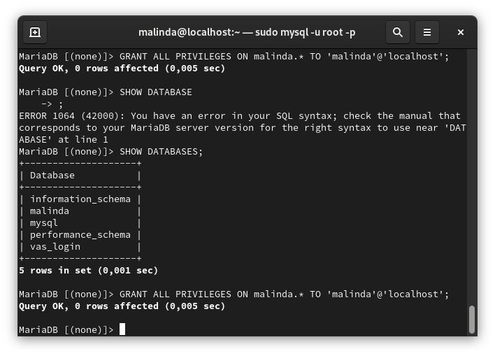
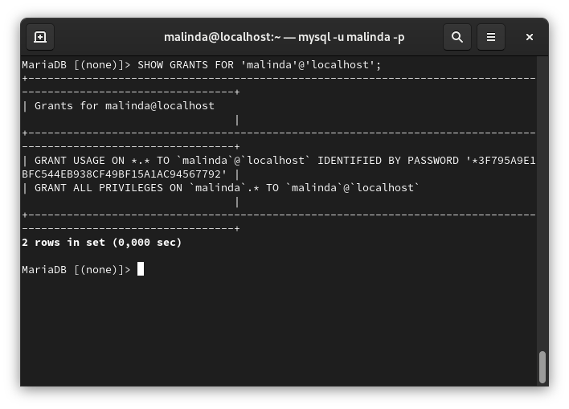
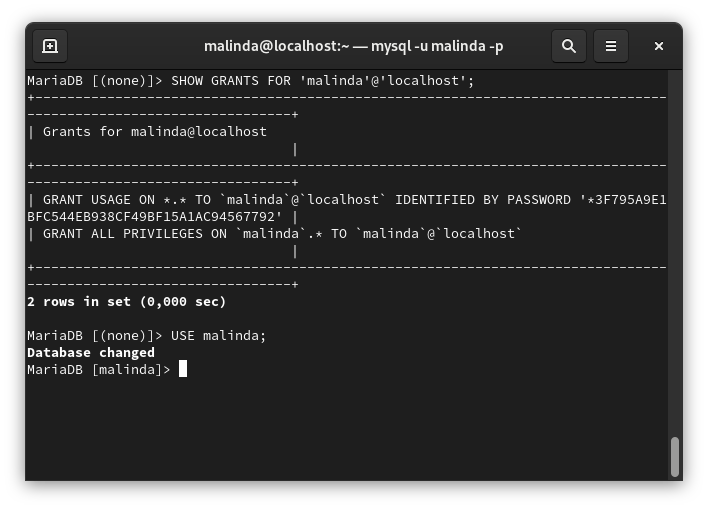
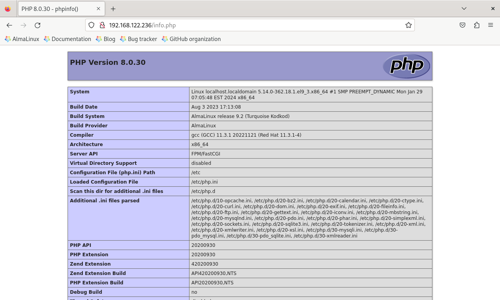
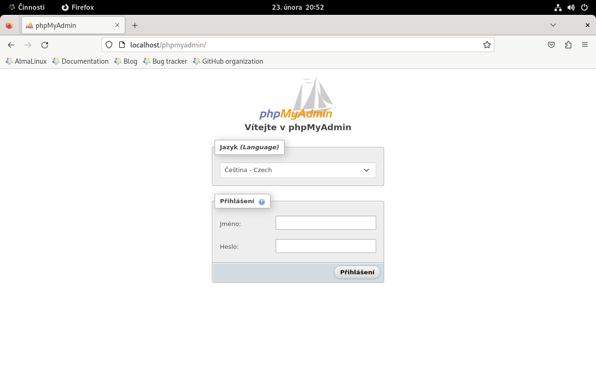
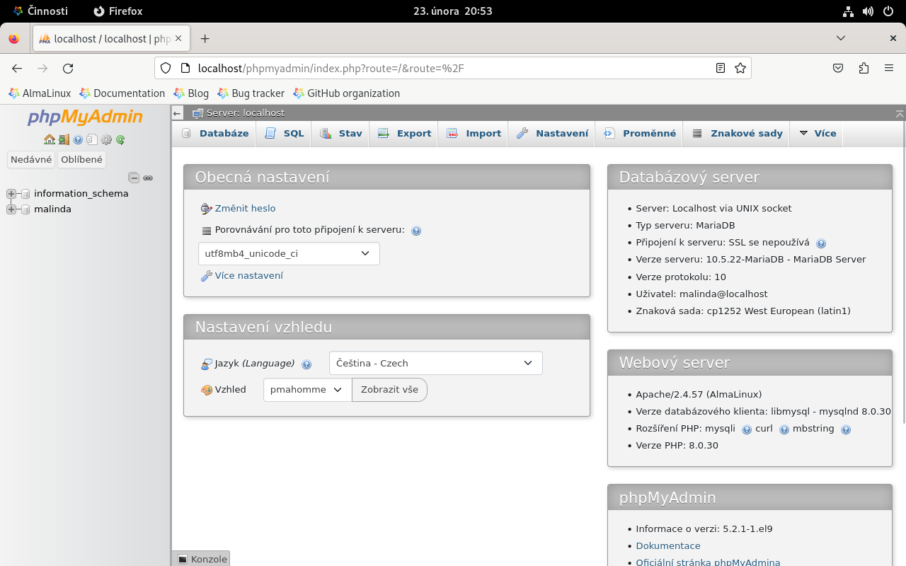

# Instalace MYSQL/MARIADB

- Instalace MariaDB *(vybral jsem si MariaDB a jsou to stejné věci a fungují stejně)*

```bash
sudo dnf install mariadb-server mariadb-client
```

- Spustím službu *(deamona)* MariaDB

```bash
sudo systemctl now mariadb --now
```

- Provedeme základní nastavené DB pomocí tohoto příkazu
```bash
sudo mysql_secure_installation
```

# Vytvoření DB s vaším loginem a přiřadíme uživatele

- Připojíme se do DB
```bash
sudo mysql -u root -p
```

- Vytvoříme novou DB
```sql
CREATE DATABASE malinda;
```

- Uděláme screenshot databáze s naším jménem
```sql
SHOW DATABASES;
```

 


- Uděláme uživatele s naším loginem
```SQL
CREATE USER 'malinda'@'localhost' IDENTIFIED BY 'Password1*';
```

- Přiřadíme uživatele k DB
```sql
GRANT ALL PRIVILEGES ON malinda.* TO 'malinda'@'localhost';
```

- Uděláme screenshot příkazu který proběhl

 

- Reloadneme privilegia *(aby to fungovalo)*

```sql
FLUSH PRIVILEGES;
```

- Zkontroluje jestli jsme správně přiřadili pravomoce
```sql
SHOW GRANTS FOR 'malinda'@'localhost';
```
 


- A teď se musíme odhlásit z **ROOT** a

```sql
EXIT;
```

- A přlásíme se jako náš nově vytvořený uživatel

```bash
sudo mysql -u malinda -p
```
- A použijeme tu databázi co jsme vytvořili
```sql
USE malinda;
```
 

# Instalace apache s php

- Instalujeme balíčky
```bash
sudo dnf install httpd php php-mysqlnd
```

- Spustíme Deamona
```bash
sudo systemctl enable httpd --now
```

- Vytvoříme soubor `info.php`
```bash
sudo nano /var/www/html/info.php
```

- A napíšeme 
```php
<?php phpinfo(); ?>
```



# Instalace phpMyAdmin

- Pro instalaci potřebujeme, přidat EPEL repositář

```bash
sudo dnf install epel-release
```

- Nainstalujeme
```bash
sudo dnf install phpmyadmin
```

- Restartujeme Deamona
```bash
sudo systemctl restart httpd
```
 

- Přihlásime se

 
