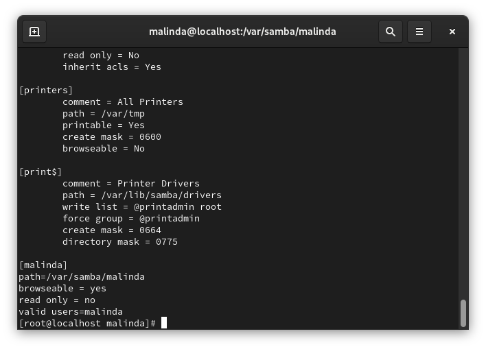
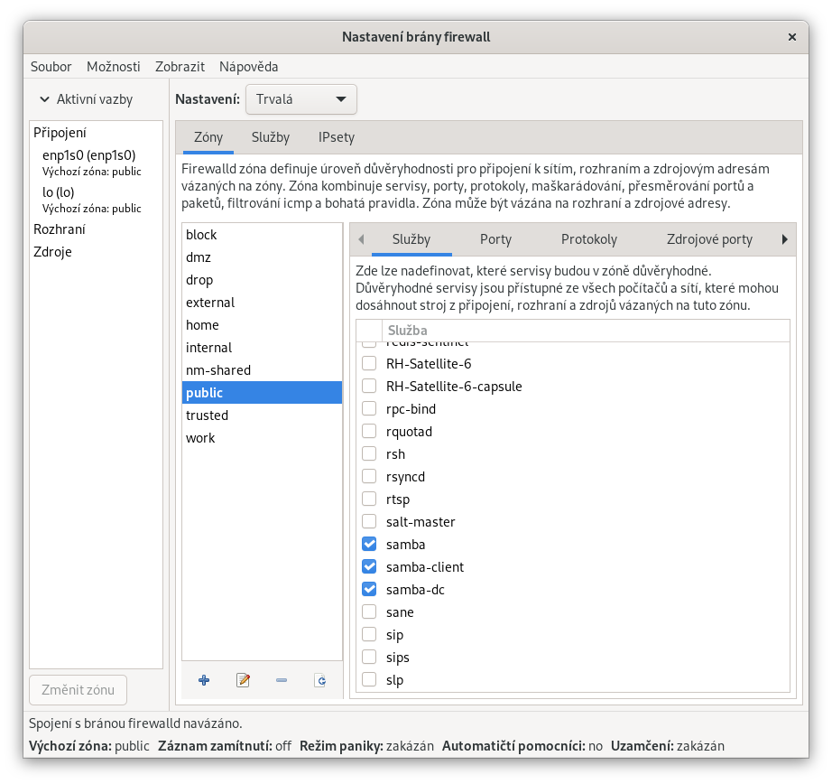
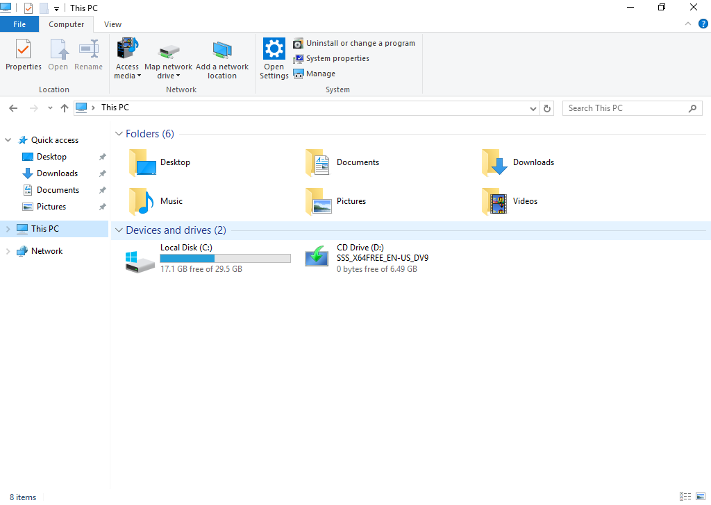
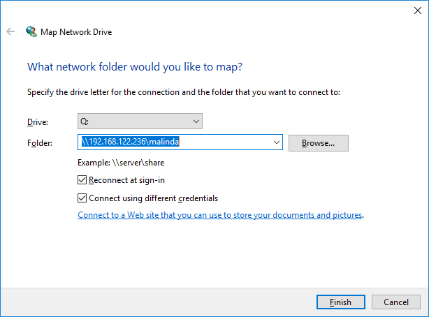
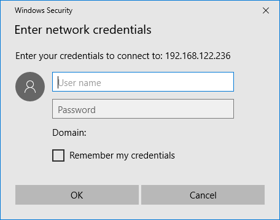
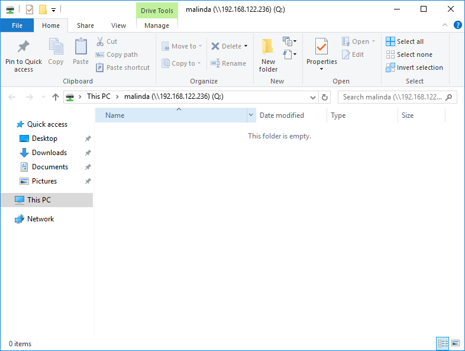
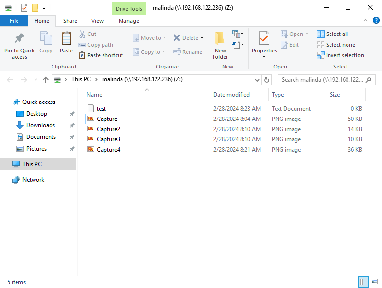
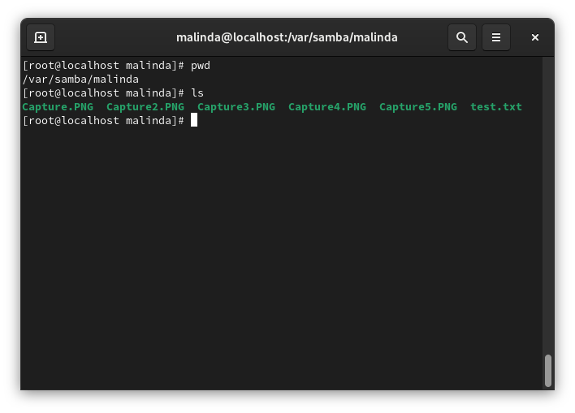

# Nainstalujeme SAMBA


```bash
dnf install samba
```

# Vytvoříme složky a nastavíme práva

- Vytvoříme složku s loginem

```bash
sudo mkdir -p /var/samba/malinda
```

- Nastavíme pravomoce
```bash
sudo chmod -R 777 /var/samba/malinda
```

- A teď musíme modifikovat konfigurační soubor Samby

```bash
sudo nano /etc/samba/smb.conf
```

- A nakonec configurace přidáme sekci pro naší složku

```conf
[malinda]
    path=/var/samba/malinda
    browseable = yes
    read only = no
    valid users=malinda
```

 

- Ještě musíme nastavit heslo pro Sambu
```bash
sudo smbpasswd -a malinda
```

- **Uložíme** a restartujeme deamona

```bash
sudo systemctl restart smb nmb
```

# Firewall
- Musíme v Linuxu povolit přístup ve firewallu

 

- A reloadneme deamona `firewalld`

```bash
sudo systemctl restart firewalld
```
# SELinux
- Abychom mohli zapisovat do složky musíme upravit SELinuxu
```bash
sudo setsebool -P samba_enable_home_dirs on
sudo setsebool -P samba_export_all_rw only
```

- Nastavíme správný SELinux kontext pro naší složku
```bash
sudo semanage fcontext -a -t samba_share_t "/var/samba/malinda(/.*)?"
sudo restorecon -Rv /var/samba/malinda
```

# Připojení přes Windows
> [!NOTE]
> Aby jste se mohli připojit musí být zapnuté Linux VM i Windows VM zároveň.
> Abychom se připojili z Windows na Linux samba tak musíme mít tyto dvě VMs v jedné síti a musíme znát jejich IP adresy

- Na našem Windows si otevřeme **File explorer**


- Dáme **Map Network Drive**


```bash
# Jako cestu dáme ip_našeho_serveru\vas_login
\\192.168.122.236\malinda
```
- Zvolíme **Connect using different credentials**



- Přihlásíme se pomocí našeho vytvořeného hesla a našeho loginu

 

- A máme připojeno



- Zkusíme nahrát nějaké soubory



- Otestujeme v Linuxu

 
